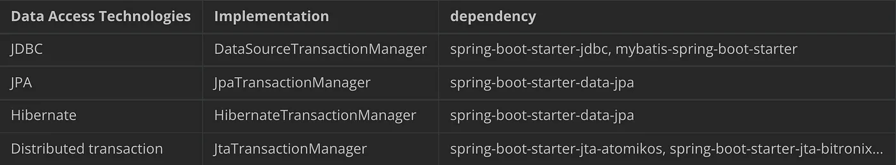

### Transaction type

Spring’s transaction mechanism is a unified mechanism for handling transactions for different data access technologies, and Spring’s transaction mechanism provides a PlatformTransactionManager interface, Different data access technologies implement their different way from this interface.



### Transaction thread based

A transaction is thread based, if you do operation in a new thread, it won't be a rollback on parent/child thread.
So you create an inconsistent database.

### Transaction proxied class

You need to know that when you call a method annoted with @Transactional in the same class, no transaction is created.
When you annoted a method with @Transactional, spring create a proxy, if you don't pass by this proxy, no transaction.
To resolve this issue, you can put the method in another service or use a lazy instance of your service directly inside itself.

```java
public class MyClass {

    @Autowired @Lazy
    private MyClass lazyInstance;

    public void mySuperMethod() {
        // My changed will NOT be in a transaction
        this.myTransactionalMethod();
    }

    public void mySecondSuperMethod() {
        // My changed will be in a transaction
        this.lazyInstance.myTransactionalMethod();
    }

    @Transactional
    public void myTransactionalMethod() {
        // Apply changes to database
    }
}
```

### Transaction rollback strategy

You need to know, only unchecked exception are automatically rollback, so all Exception that extends RuntimeException and Error.
Spring want you manage other exception depending of your business.

So, you need to precise any exception you want a rollback like that :

```java
@Transactional(rollbackFor={MyCustomExceptionThatExtendsException.class})
public void method() {
}
```


### Best practices

1. Avoid the long/big transaction as possible as we can.

As Long/Big Transaction will coz many problems.

    When rollback happens will cost a long time.
    when the concurrent operation may take over all the active DB connections
    If the endpoint has a long transaction may coz a response timeout.
    deadlock
    lock wait

2. Put the select/query DB operation method out of the transaction.

3. Avoid one transaction handling too much data.

4. Avoid putting the remote call into a transaction. (remote call may take a while)

5. some needed functions maybe we don’t need to use transaction. or we may use @Async to handle it.